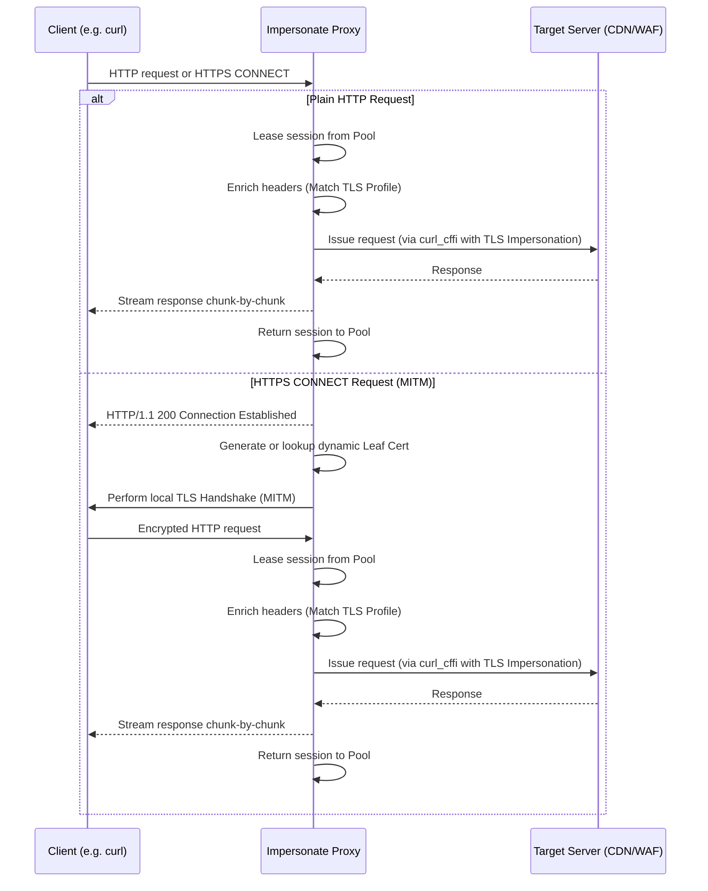

# How It Works (Architecture & Workflow)

`impersonate-proxy` acts as a transparent intermediary that sits between client applications (like `curl`, `ffmpeg`, or Python HTTP clients) and the destination servers. It prevents fingerprint blocking by aligning the client's TLS handshake fingerprint with its HTTP headers.

---

## 1. Request Interception Workflow

Below is a diagram illustrating how the proxy handles client requests:



---

## 2. Dynamic Certificate Generation (MITM)

For HTTPS requests, the proxy establishes a Man-in-the-Middle (MITM) state to inspect headers and decrypt the client payload.

1. **Root CA Generation**: At startup, if no CA files are found, the proxy creates a root CA private key and self-signed certificate using fast **ECDSA SECP256R1 (P-256)** keys.
2. **Leaf Certificate Issuance**:
    - For each requested domain, the proxy generates a leaf certificate signed by the root CA.
    - **Optimization**: To avoid CPU bottleneck during RSA key creation, the proxy generates an ECDSA P-256 leaf certificate and reuses a single static leaf key (`_LEAF_KEY`) globally across all generated certs. This reduces leaf cert generation times to `<1ms`.
3. **Certificate Caching**: Generated `ssl.SSLContext` structures are stored in a thread-safe cache (`_HOST_CERT_CACHE`). If the cache grows beyond 256 hosts, the least recently used (LRU) context is evicted automatically.

---

## 3. Keep-Alive Connection & Session Pooling

Under load (such as bursts of ~100 concurrent requests), initiating new `curl_cffi` sessions is resource-intensive due to easy handle allocation and TLS handshakes.

- **Global Session Pool**: The proxy manages a queue-based `_SESSION_POOL` containing reusable `curl_cffi` sessions (capped at 32).
- **Upstream Keep-Alive**: Reusing sessions maintains active TCP connections to target hosts. Subsequent requests to the same target domain completely bypass DNS resolving and TCP/TLS handshake steps.
- **Resource Leasing**: When a request starts, a session is leased from the pool. The proxy wraps the response's `close()` method so that the session is automatically returned to the pool only when the response stream has been fully consumed or closed by the client.

---

## 4. Header Modes

This is one of the most important — and often overlooked — mechanisms in the proxy. It is what makes the difference between bypassing a WAF and getting blocked.

### Why it matters

WAF/CDN systems such as Cloudflare, Akamai, and Imperva perform **two independent fingerprinting checks**:

1. **TLS fingerprint** (JA3/JA4): based on the SSL ClientHello — cipher suites, extensions, elliptic curves, etc.
2. **HTTP header fingerprint**: based on the presence and ordering of HTTP headers — `User-Agent`, `Accept`, `Accept-Language`, `Accept-Encoding`, `Sec-Fetch-*`, and Chrome Client Hints (`Sec-Ch-Ua-*`).

`curl_cffi` handles the TLS side flawlessly by using libcurl patched with browser fingerprints. However, if you send a `curl/7.81.0` User-Agent or omit `Sec-Fetch-Dest` headers, the WAF sees a TLS handshake that says "Chrome 120" and headers that say "curl" — an immediate mismatch that triggers a block.

The proxy therefore exposes **three mutually-exclusive header modes** plus an orthogonal **client-leak stripping** flag.

### The three header modes

| Mode | Flag | Env var | Behaviour |
|------|------|---------|-----------|
| **enrich** (default) | `--enrich-headers` | `IMPERSONATE_PROXY_HEADER_MODE=enrich` | Replace non-browser User-Agents; **add** any missing browser headers. Existing client headers are preserved. |
| **passthrough** | `--passthrough-headers` | `IMPERSONATE_PROXY_HEADER_MODE=passthrough` | Forward client headers untouched (curl_cffi only manages TLS). You are fully responsible for header/TLS consistency. |
| **override** | `--override-headers` | `IMPERSONATE_PROXY_HEADER_MODE=override` | **Replace** the curated browser-header set (`Accept`, `Accept-Encoding`, `Sec-*`, `User-Agent`, etc.) with the profile defaults; **drop** navigation-mismatch tells (`Cache-Control`, `DNT`, `Connection`); preserve cookies, auth, referer, content-type, cache-conditionals, and custom `X-*` headers. Designed for clients that leak non-browser signals (e.g. SearXNG, httpx, aiohttp). |

### `--strip-client-leak-headers` (orthogonal)

Drops middlebox-chain and tracing headers that a client may realistically forward and that betray the request as coming through a proxy or non-browser client. Combinable with any header mode:

- `X-Forwarded-For`, `X-Forwarded-Host`, `X-Forwarded-Proto`, `X-Forwarded-Server`
- `Forwarded` (RFC 7239)
- `Via`
- `X-Request-ID`, `X-Correlation-ID`

Env var: `IMPERSONATE_PROXY_STRIP_CLIENT_LEAK_HEADERS=true`.

**CDN-ingress headers are *not* stripped.** Headers such as `X-Real-IP`, `True-Client-IP`, `CF-Connecting-IP`, `X-Cluster-Client-IP`, and `Fastly-Client-IP` are normally added by a CDN/edge layer on ingress to the CDN — they should never appear in a client request. If one is present, it indicates a misconfiguration (or replay of captured traffic); the proxy **logs a warning and forwards it unchanged** so the misconfig is visible to the operator rather than silently swallowed.

### How each mode works

When a request arrives at the proxy, `_prepare_headers()` dispatches on the active mode:

1. **passthrough** — returns a copy of the client headers with no changes.
2. **enrich** — detects non-browser User-Agents (substring match on `curl`, `python`, `requests`, `urllib`, `wget`, `httpclient`, `go-http-client`, `postman`, `httpx`, `aiohttp`) and replaces them with the profile default. Any browser header from the profile defaults that is **absent** from the client request is then injected. Existing headers (other than the non-browser UA) are preserved.
3. **override** — always replaces the User-Agent with the profile default (regardless of whether the client UA looked like a browser), then **overwrites** the curated header set with the profile defaults, then **drops** `Cache-Control`, `DNT`, and `Connection` (logging a warning for `Connection` because curl_cffi manages it internally). All other client headers — `Cookie`, `Authorization`, `Referer`, `Origin`, `Content-Type`, `If-*`, `Range`, `Host`, `X-API-Key`, custom `X-*` — are preserved.

### Chrome profile headers (enrich injected / override replaced with)

Values sourced from the [curl-impersonate captured signature for Chrome 142](https://github.com/lexiforest/curl-impersonate/blob/main/tests/signatures/chrome_142.0.7444.176.yaml),
aligned with curl_cffi's default `chrome` target (`chrome146` as of curl_cffi >= 0.7).
The OS is macOS to match the TLS fingerprint's claimed OS — using Windows here
would create a TLS-vs-headers OS mismatch detectable by WAFs.

```
User-Agent: Mozilla/5.0 (Macintosh; Intel Mac OS X 10_15_7) AppleWebKit/537.36 (KHTML, like Gecko) Chrome/146.0.0.0 Safari/537.36
Accept: text/html,application/xhtml+xml,application/xml;q=0.9,image/avif,image/webp,image/apng,*/*;q=0.8,application/signed-exchange;v=b3;q=0.7
Accept-Language: en-US,en;q=0.9
Accept-Encoding: gzip, deflate, br, zstd
Upgrade-Insecure-Requests: 1
Sec-Ch-Ua: "Chromium";v="146", "Google Chrome";v="146", "Not_A Brand";v="99"
Sec-Ch-Ua-Mobile: ?0
Sec-Ch-Ua-Platform: "macOS"
Sec-Fetch-Dest: document
Sec-Fetch-Mode: navigate
Sec-Fetch-Site: none
Sec-Fetch-User: ?1
Priority: u=0, i
```

### Firefox profile headers

Values sourced from the [curl-impersonate captured signature for Firefox 144](https://github.com/lexiforest/curl-impersonate/blob/main/tests/signatures/firefox_144.0.0_linux.yaml),
aligned with curl_cffi's default `firefox` target (`firefox147`). Modern Firefox
(>= 135) also advertises `zstd` and sends the `Priority` and `TE: trailers` headers.

```
User-Agent: Mozilla/5.0 (Macintosh; Intel Mac OS X 10.15; rv:147.0) Gecko/20100101 Firefox/147.0
Accept: text/html,application/xhtml+xml,application/xml;q=0.9,*/*;q=0.8
Accept-Language: en-US,en;q=0.5
Accept-Encoding: gzip, deflate, br, zstd
Upgrade-Insecure-Requests: 1
Sec-Fetch-Dest: document
Sec-Fetch-Mode: navigate
Sec-Fetch-Site: none
Sec-Fetch-User: ?1
Priority: u=0, i
TE: trailers
```

### Choosing a mode

**enrich (default)** — best for clients that already send browser-shaped headers (e.g. a `requests` script with a custom `User-Agent`). The proxy only fills gaps.

**override** — best for clients that *look* like browsers but leak non-browser signals, such as **SearXNG**. SearXNG (httpx-based) sends `Accept-Encoding: gzip, deflate` (no `br`/`zstd`), `Cache-Control: no-cache`, `DNT: 1`, and may rotate User-Agents that do not match the impersonated profile. Enrich mode preserves all of those (they are valid headers, just non-browser nav defaults), so the WAF sees TLS=Chrome 120 but `Cache-Control: no-cache` on a navigation request — a strong bot tell. Override mode replaces them with the browser defaults and drops the tells.

```bash
# SearXNG recommended configuration
impersonate-proxy --override-headers --strip-client-leak-headers
```

```bash
# Or via env vars
IMPERSONATE_PROXY_HEADER_MODE=override \
IMPERSONATE_PROXY_STRIP_CLIENT_LEAK_HEADERS=true \
impersonate-proxy
```

**passthrough** — for users who want full manual control. The proxy only handles TLS; you must ensure your client's HTTP headers are consistent with the impersonated TLS profile.

!!! warning "passthrough + override trade-offs"
    With `--passthrough-headers`, no header sanitisation happens. If your client sends a `python-httpx` User-Agent or omits `Sec-Fetch-*`, WAFs will block the request despite the impersonated TLS handshake. With `--override-headers`, the `Connection` header is always dropped (curl_cffi manages HTTP/2 connection state itself); a warning is logged on each request that supplied a client `Connection` header.

### Passing your own headers

Custom `X-*` headers, `Authorization`, `Cookie`, `Referer`, `Origin`, `Content-Type`, `If-*`, and `Range` are **preserved by all three modes**. To set a custom `User-Agent` that survives the proxy, use `--passthrough-headers`:

```bash
impersonate-proxy --passthrough-headers
curl -x http://127.0.0.1:8899 -H "User-Agent: MyApp/2.0" https://example.com
```

With `--enrich-headers` (default), a non-browser UA is replaced; a browser-shaped UA is preserved. With `--override-headers`, the UA is always replaced with the profile default.

---

## 5. Sensitive Header Redaction in Logs

The proxy redacts sensitive headers (e.g. `Authorization`, `Cookie`, `X-Api-Key`) from log output by default. Full header values are only logged when `--debug` mode is active.
