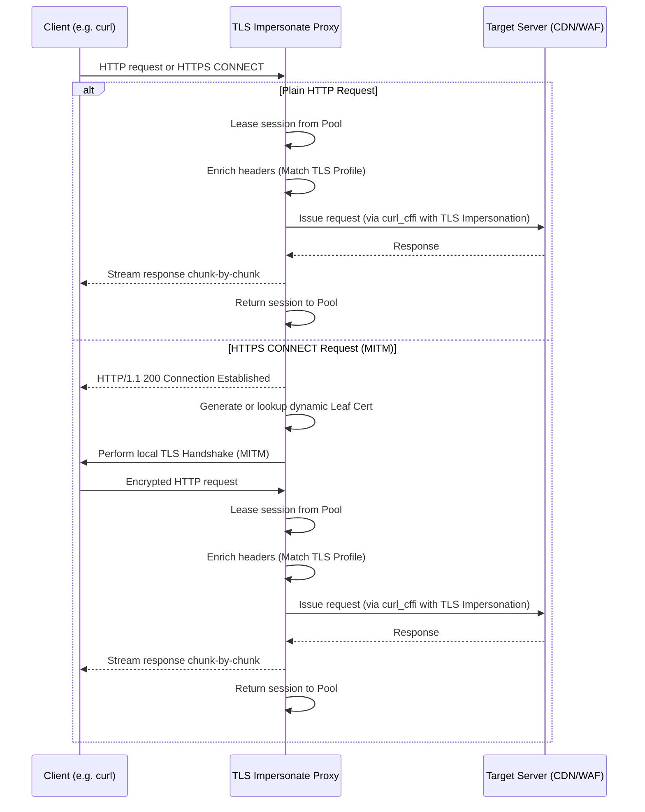

# How It Works (Architecture & Workflow)

`tls-impersonate-proxy` acts as a transparent intermediary that sits between client applications (like `curl`, `ffmpeg`, or Python HTTP clients) and the destination servers. It prevents fingerprint blocking by aligning the client's TLS handshake fingerprint with its HTTP headers.

---

## 1. Request Interception Workflow

Below is a diagram illustrating how the proxy handles client requests:



---

## 2. Dynamic Certificate Generation (MITM)

For HTTPS requests, the proxy establishes a Man-in-the-Middle (MITM) state to inspect headers and decrypt the client payload.

1. **Root CA Generation**: At startup, if no CA files are found, the proxy creates a root CA private key and self-signed certificate using fast **ECDSA SECP256R1 (P-256)** keys.
2. **Leaf Certificate Issuance**:
    - For each requested domain, the proxy generates a leaf certificate signed by the root CA.
    - **Optimization**: To avoid CPU bottleneck during RSA key creation, the proxy generates an ECDSA P-256 leaf certificate and reuses a single static leaf key (`_LEAF_KEY`) globally across all generated certs. This reduces leaf cert generation times to `<1ms`.
3. **Certificate Caching**: Generated `ssl.SSLContext` structures are stored in a thread-safe cache (`_HOST_CERT_CACHE`). If the cache grows beyond 256 hosts, the least recently used (LRU) context is evicted automatically.

---

## 3. Keep-Alive Connection & Session Pooling

Under load (such as bursts of ~100 concurrent requests), initiating new `curl_cffi` sessions is resource-intensive due to easy handle allocation and TLS handshakes.

- **Global Session Pool**: The proxy manages a queue-based `_SESSION_POOL` containing reusable `curl_cffi` sessions (capped at 32).
- **Upstream Keep-Alive**: Reusing sessions maintains active TCP connections to target hosts. Subsequent requests to the same target domain completely bypass DNS resolving and TCP/TLS handshake steps.
- **Resource Leasing**: When a request starts, a session is leased from the pool. The proxy wraps the response's `close()` method so that the session is automatically returned to the pool only when the response stream has been fully consumed or closed by the client.

---

## 4. Header Enrichment

This is one of the most important — and often overlooked — mechanisms in the proxy. It is what makes the difference between bypassing a WAF and getting blocked.

### Why it matters

WAF/CDN systems such as Cloudflare, Akamai, and Imperva perform **two independent fingerprinting checks**:

1. **TLS fingerprint** (JA3/JA4): based on the SSL ClientHello — cipher suites, extensions, elliptic curves, etc.
2. **HTTP header fingerprint**: based on the presence and ordering of HTTP headers — `User-Agent`, `Accept`, `Accept-Language`, `Sec-Fetch-*`, and Chrome Client Hints (`Sec-Ch-Ua-*`).

`curl_cffi` handles the TLS side flawlessly by using libcurl patched with browser fingerprints. However, if you send a `curl/7.81.0` User-Agent or omit `Sec-Fetch-Dest` headers, the WAF sees a TLS handshake that says "Chrome 120" and headers that say "curl" — an immediate mismatch that triggers a block.

**Header enrichment solves this by intercepting the outgoing request headers before they reach the upstream server and ensuring they are consistent with the active impersonation profile.**

### How enrichment works

When a request arrives at the proxy, `_enrich_headers()` applies the following logic:

1. **Detect non-browser User-Agents**: The incoming `User-Agent` is compared against a blocklist of well-known non-browser patterns: `curl`, `python`, `requests`, `urllib`, `wget`, `httpclient`, `go-http-client`, `postman`.
2. **Replace with a matching browser UA**: If a non-browser UA is detected, it is replaced with the correct browser User-Agent for the active impersonation profile (e.g. Chrome 120 on Windows).
3. **Inject missing browser headers**: Any header from the profile's default set that is not already present in the client request is injected. This is **additive only** — existing headers from your client are never overridden (except the UA replacement in step 2).

### Chrome profile headers injected

```
User-Agent: Mozilla/5.0 (Windows NT 10.0; Win64; x64) AppleWebKit/537.36 (KHTML, like Gecko) Chrome/120.0.0.0 Safari/537.36
Accept: text/html,application/xhtml+xml,...,*/*;q=0.8
Accept-Language: en-US,en;q=0.9
Upgrade-Insecure-Requests: 1
Sec-Ch-Ua: "Not_A Brand";v="8", "Chromium";v="120", "Google Chrome";v="120"
Sec-Ch-Ua-Mobile: ?0
Sec-Ch-Ua-Platform: "Windows"
Sec-Fetch-Dest: document
Sec-Fetch-Mode: navigate
Sec-Fetch-Site: none
Sec-Fetch-User: ?1
```

### Firefox profile headers injected

```
User-Agent: Mozilla/5.0 (Windows NT 10.0; Win64; x64; rv:109.0) Gecko/20100101 Firefox/119.0
Accept: text/html,application/xhtml+xml,application/xml;q=0.9,image/avif,image/webp,*/*;q=0.8
Accept-Language: en-US,en;q=0.5
Upgrade-Insecure-Requests: 1
Sec-Fetch-Dest: document
Sec-Fetch-Mode: navigate
Sec-Fetch-Site: none
Sec-Fetch-User: ?1
```

!!! note "Client-set headers are preserved"
    Header enrichment is **non-destructive**. If your client already sets `Accept-Language` or `User-Agent`, those values are preserved as-is (except for the explicit non-browser UA replacement). The proxy only fills in what is missing.

### Passing your own headers

If you need full control over outgoing headers — for example, to send a custom `User-Agent`, `Authorization`, or application-specific `Accept` header — you have two options:

**Option 1 — Set headers in your client** (recommended):

Enrichment only injects headers that are *absent* from the client request. If you set a header in your client, it will pass through unchanged:

```bash
# Your custom User-Agent is preserved — enrichment skips injection
curl -x http://127.0.0.1:8899 \
  -H "User-Agent: MyApp/2.0" \
  https://example.com
```

**Option 2 — Disable enrichment entirely** with `--no-enrich-headers`:

```bash
tls-impersonate-proxy --no-enrich-headers
```

Or via environment variable:

```bash
TLS_PROXY_ENRICH_HEADERS=false tls-impersonate-proxy
```

With enrichment disabled, headers are forwarded exactly as received from the client — nothing is added or modified. This gives you complete control, but you become responsible for ensuring your headers are consistent with the TLS fingerprint.

!!! warning "Disabling enrichment may cause blocks"
    When `--no-enrich-headers` is active, the proxy still impersonates the TLS fingerprint (e.g. Chrome 120), but sends whatever HTTP headers the client provides. If those headers include a non-browser `User-Agent` or are missing `Sec-Fetch-*` headers, many WAFs will still block the request due to the TLS/HTTP fingerprint mismatch.

---

## 5. Sensitive Header Redaction in Logs

The proxy redacts sensitive headers (e.g. `Authorization`, `Cookie`, `X-Api-Key`) from log output by default. Full header values are only logged when `--debug` mode is active.
